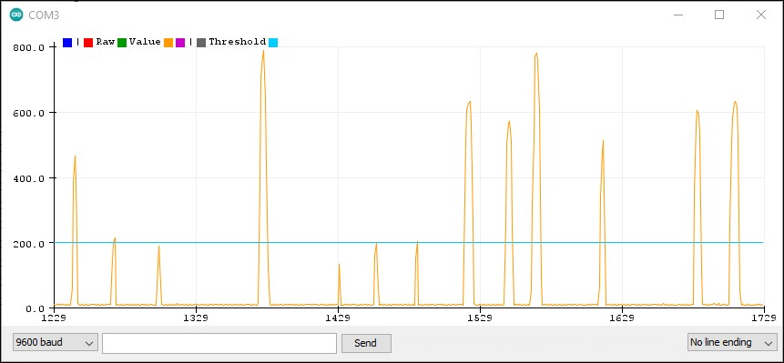

# SPC-Library
An Arduino Library for easy signal conditioning of Analog Signals. SPC stands for Square, Peaks and Counts. This library can be used for signal conditioning, where an Analog input is to be analyzed. The analog signal is converted into a square wave based on the threshold value given by the user, and positive edges are counted. It can be used for any analog sensor

# Syntax for calling functions
## SPC_getSquare Function
int x = SPC_getSquare(int THRESHOLD, int CURRENT_SENSOR_STATE);
_The threshold needs to be given by the user based on the sensor being used and the level of Signal Conditioning required._ CURRENT_SENSOR_STATE _is the analog value that needs to be converted into square wave._

## SPC_getCount Function
int y = SPC_getCount(int CURRENT_SQUARE_STATE);
CURRENT_SQUARE_STATE _can be determined using the SPC_getSquare function, or any other square wave can be used._

### This image shows the raw value of an analog signal along with the threshold given by the user.

# References
1. http://www.sensingthecity.com/force-sensor-peak-detection/
2. https://itp.nyu.edu/physcomp/labs/labs-arduino-digital-and-analog/lab-sensor-change-detection/

>Release Date: 29/12/2020, 
>Author: Aaryaa Padhyegurjar
